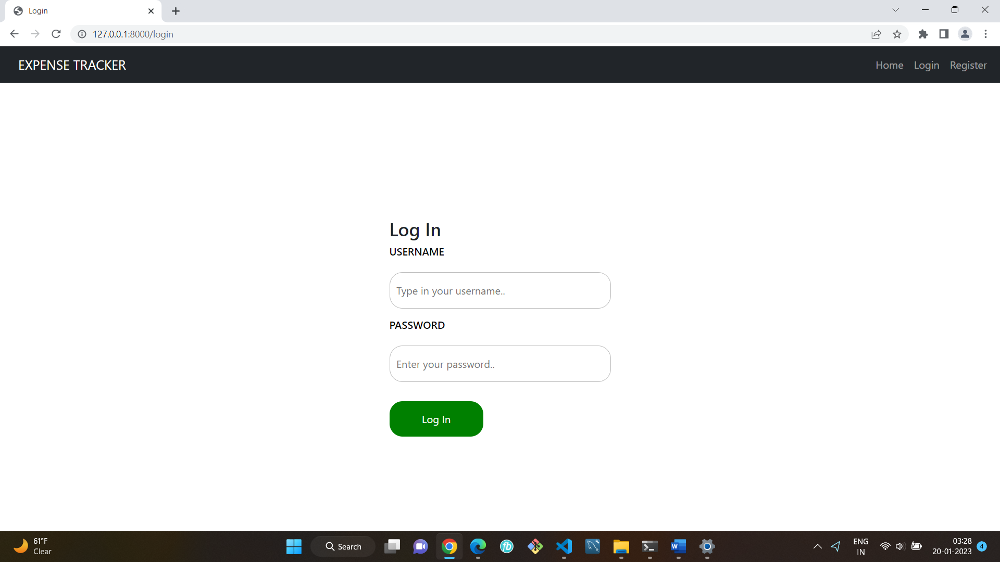
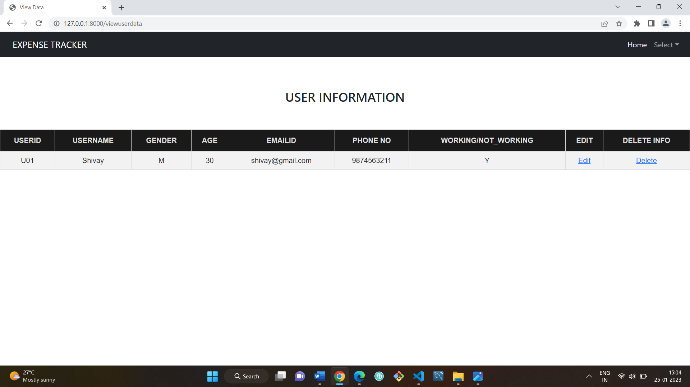
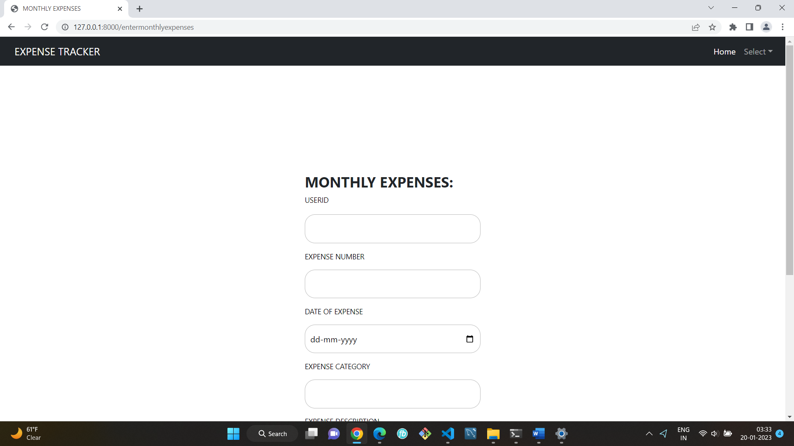
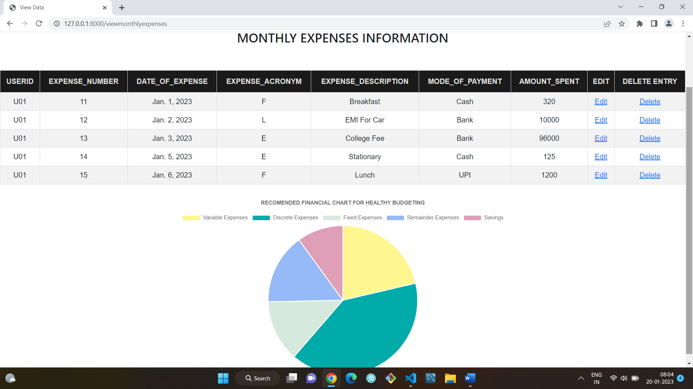

# EXPENSE TRACKER
The Expense Tracker project is a database management system with CRUD functionality. Its purpose is to assist users in managing their expenses by allowing them to input their net income, sources of income, and monthly expenses. When users make expenditure entries, the system deducts the corresponding amount from their net amount, enabling them to track their past expenses and make informed decisions to reduce expenses in the future.

__Requirements:__
 Web-based Framework: Django 4.1.2
 
 __Screenshots:__
__Login Page:__

__Home Page:__

__User Information Page:__

__Enter Monthly Expenses:__

__View Monthly Expenses:__

    

